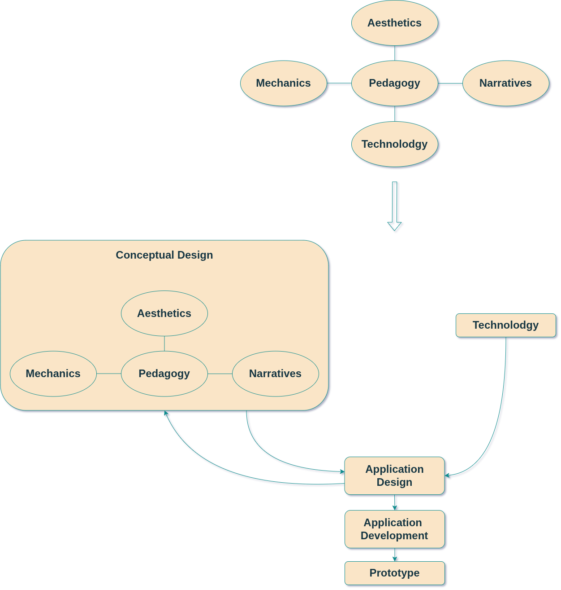

# Design & Development Process

Overview (2/3)

  

    

      
    

    Figure 1: Educational Game Design.<Link class='ref-link' to=''>[1]</Link>
  

  

    

      <h4><strong>1. Technology: Flutter Framework & Flame Game Engine</strong></h4>
      <ul class=''>
        <li>Single codebase</li>
        <li>Lower development cost</li>
        <li>Lower maintenance cost</li>
        <li>Balance between performance and cost</li>
        <li>Libraries for quantum circuits simulation</li>
      </ul>
    

    

      <h4><strong>2. Pedagogy</strong></h4>
      <ul class=''>
        <li>Research for quantum mechanics concepts</li>
        <li>Research for similar educational games to define educational content</li>
      </ul>
    

  

