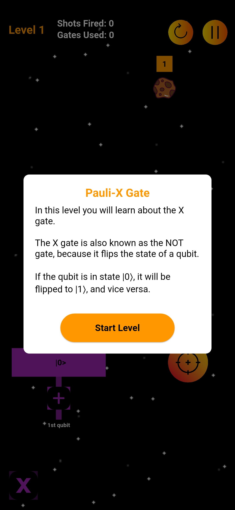
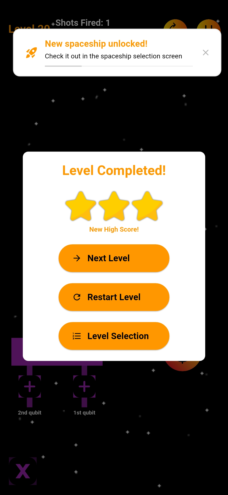

# Literature Review

Findings (3/3)

  

    <h2>GBL Elements</h2>
    <ul class='flex-list'>
      <li v-after class='fade-out-vclick'>
        <strong>Learning Mechanics</strong>: Link quantum computing concepts to game mechanics.
      </li>
      <li v-after class='fade-out-vclick'>
        <strong>Assessment Mechanics</strong>: Quiz integration to measure learning outcomes.
      </li>
      <li v-click='+1' class='fade-out-vclick'>
        <strong>Narratives</strong>: Overlays to introduce theory and game rules.
      </li>
      <li v-click='+2' class='fade-out-vclick'>
        <strong>Graceful Failure</strong>: Allowing mistakes without immediate penalty or negative feedback.
      </li>
      <li v-click='+3' class='fade-out-vclick'>
        <strong>Incentive System</strong>: Awarding 1 to 3 stars based on performance.
      </li>
      <li v-click='+3' class='fade-out-vclick'>
        <strong>Incentive System</strong>: Unlocking new spaceships to boost motivation and engagement.
      </li>
      <li v-click='+3' class='fade-out-vclick'>
        <strong>Incentive System</strong>: No leaderboard to prevent frustration and discrimination.
        <Link class='ref-link' to='20'>[2]</Link>
      </li>
    </ul>
  

  

    

      

        
      

      Figure 2: Narratives.
    

    

      

        
      

      Figure 3: Incentive System.
    

  

