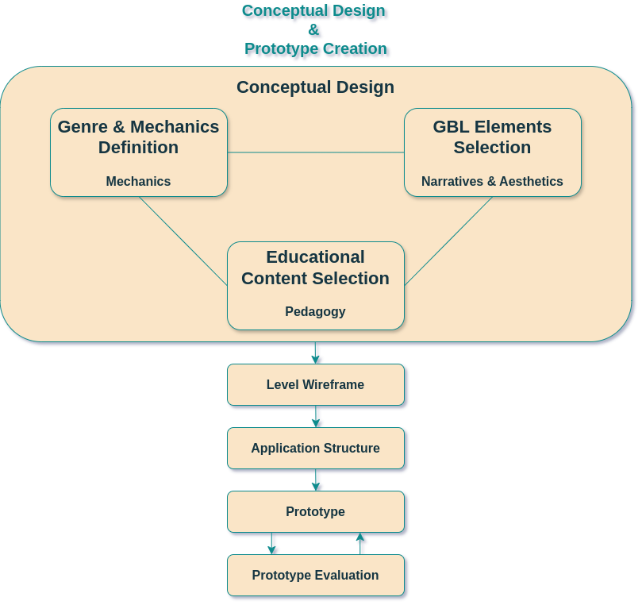

# Design and Development Process

Overview

  

    
  

  

    

      

        The design and development process followed a waterfall model.
      

      

        We started with the conceptual design, then created a wireframe for a game level, and then defined the application architecture.
      

      

        After that, we implemented a prototype of the game, which was then tested and evaluated.
      

      

        The evaluation of the prototype led to the final design and development of the application.
      

    

  

