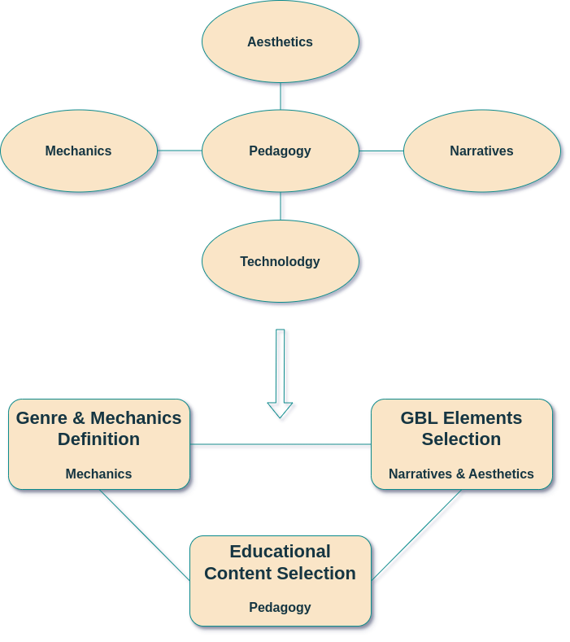

# Design and Development Process

Conceptual Design (1/2)

  

    
  

  

    

      

        According to Kalmpourtzis (2018)<Link class='ref-link' to=''>[1]</Link>, there are five elements to consider when designing an educational game: Pedagogy, Mechanics, Technology, Aesthetics, and Narratives.
      

      

        Having already chosen the technologies we will use, we proceeded with the design process around 3 dimensions: Pedagogy, Mechanics, and Aesthetics-Narratives.
      

    

    

    

      <ol class='ol-flex'>
        <li>
<strong>Pedagogy:</strong> Quantum Computing concepts to include in the game

          <ul>
            <li>Quantum Bits</li>
            <li>Quantum Registers</li>
            <li>Quantum Gates: Pauli-X, Pauli-Y, Pauli-Z, Hadamard</li>
            <li>Superposition</li>
          </ul>
        </li>
      </ol>
    

  

