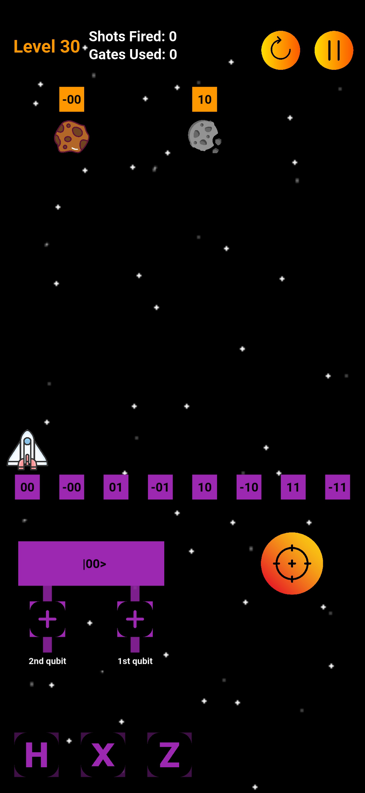

# Application Presentation

Name, Objective and Main Elements

  

    

      

        The application we developed is called <em><strong>Qubity</strong></em>.
      

      

        Qubity is inspired by the arcade video-game <em>Space Invaders</em>.
      

      

        The game is a 2D puzzle and shooter game, where the player controls a spaceship that can move horizontally across the screen and shoot missiles upwards.
      

      

        The objective of each level is to destroy all the asteroids on the screen.
      

    

    

    

      

        The game has 30 levels, each level has a different number of asteroids and different gates available.
      

    

    

    

      

        The player has to solve the puzzle by applying the correct gates to the register, in order to move the spaceship to the correct position and then shoot the missiles to destroy the asteroids.
      

    

  

  

    
  

