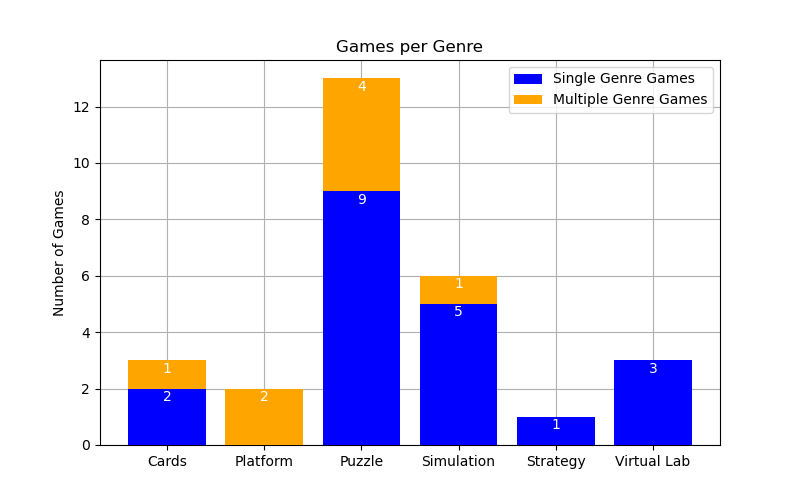

# Literature Review

Literature Review Outcomes (1 / 2)

  <ol class='ol-flex'>
    <li>
Genre choice: Puzzle Game

      <ul>
        <li v-click>Have simple mechanics and rules</li>
        <li v-click>Information retention boost</li>
        <li v-click>Majority of existing games are Puzzle games</li>
      </ul>
    </li>
    <li v-click='+4'>
GBL Elements and Techniques

      <ul>
        <li v-click='+5'>Adaptivity</li>
        <li v-click='+5'>Graceful Failure</li>
        <li v-click='+6'>Incentive System</li>
        <li v-click='+6'>Information Visualization with interactive graphic elements</li>
        <li v-click='+7'>Musical Score</li>
        <li v-click='+7'>Narratives</li>
      </ul>
    </li>
  </ol>

  

