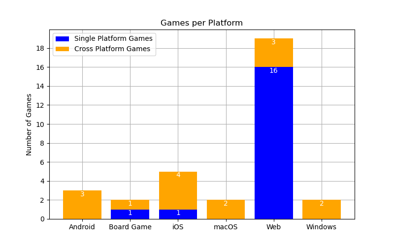

# Literature Review

Literature Review Outcomes (2 / 2)

  <ol class='ol-flex' start=3>
    <li>
Quantum Computing concepts to include in the game

      <ul>
        <li v-click='+1'>Quantum Bits</li>
        <li v-click='+1'>Quantum Registers</li>
        <li v-click='+2'>Quantum Gates: Pauli-X, Pauli-Y, Pauli-Z, Hadamard</li>
        <li v-click='+2'>Superposition</li>
      </ul>
    </li>
    <li >
Limited number of playable educational games for mobile devices

      <ul>
        <li>Only 1 of the mobile games is still playable</li>
        <li>Strengthens our desire to create a mobile game</li>
      </ul>
    </li>
  </ol>

  

