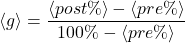

# Evaluation

Methodology

  <h2>The evaluation process consists of a mix of methods:</h2>
  <ul class='flex-list'>
        <li>Pre-Post Tests <Link to='23'>[3],[4]</Link>: Evaluation of learning outcome (23 participants).</li>
        <li>System Usability Scale Questionnaire <Link to='23'>[5],[6]</Link>: Evaluation of the game as an interactive system (15 participants).</li>
        <li>Game User Experience Satisfaction Scale <Link to='24'>[7],[8]</Link>: Evaluation of the game experience (15 participants).</li>
        <li>Focus Group <Link to='24'>[9],[10]</Link>: Qualitative feedback & Confirmation of questionnaire results (8 participants).</li>
        <li>Post Test Repetition: Evaluation of knowledge retention (10 participants).</li>
  </ul>
  

  

    To measure the effectiveness of the game as a learning tool, we used the <em>Average Normalized Gain</em> metric <Link to='23'>[3]</Link>:
  

  

    
  

