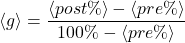

# Evaluation

Pre-Post Tests 1/2: Preparation 

  <h2>Quiz Preparation</h2>
  <ul class='flex-list'>
    <li>
      Creation of quiz repository with candidate questions [3],[4].
    </li>
    <li>
      Selection of questions based on difficulty and relevance to game content.
    </li>
    <li>
      Quiz consists of 12 questions, 3 theoretical and 9 related to quantum gates operations.
    </li>
    <li>
      Each question has 4 possible answers, with only one correct answer.
    </li>
  </ul>
  

  

    To measure the effectiveness of the game as a learning tool, we used the <em>Average Normalized Gain</em> metric <Link to=''>[3]</Link><Link to=''>[5]</Link>:
  

  

    
  

