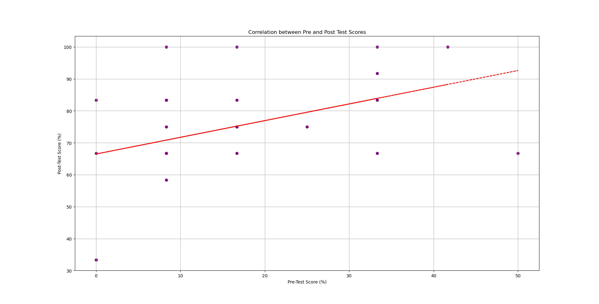

# Evaluation

Results (1/x)

  

    
  

  

    <ul class='flex-list'>
      <li>
        Moderate positive correlation between initial scores and final scores.
      </li>
      <li>
        High variance can be explained by the participants' educational background.
      </li>
    </ul>
  

