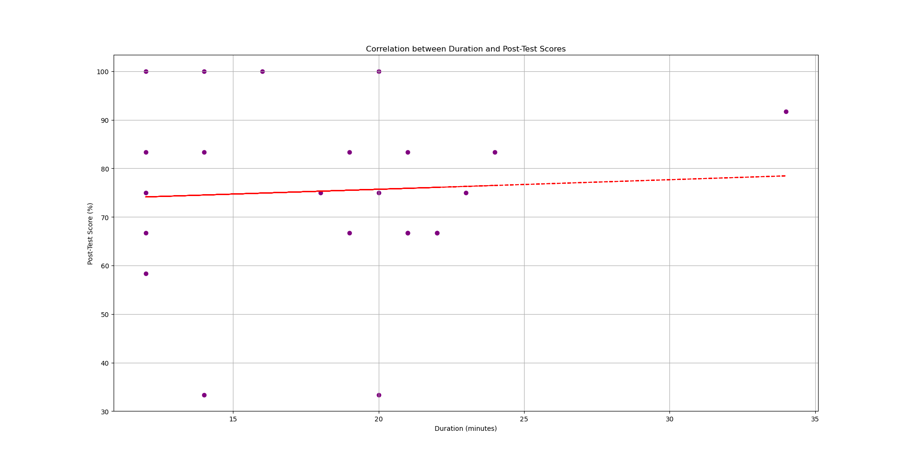

# Evaluation

Pre-Post Tests results (4/4)

  

    
  

  

    <ul class='flex-list'>
      <li>
        Weak positive correlation between completion time and final scores
      </li>
      <li>
        Average completion time of 18 minutes
      </li>
    </ul>
  

