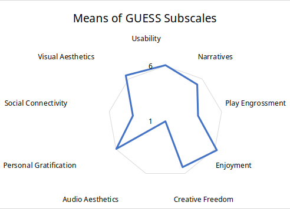

# Evaluation

GUESS-18 Questionnaire results

  

    <ul class='flex-list none'>
      <h2>Strengths</h2>
      <li class='check'>
        <strong>Visual Aesthetics (6.4) & Enjoyment (6.2):</strong> enjoyable and visually appealing.
      </li>
      <li class='check'>
        <strong>Usability (6):</strong> ease of use and navigation.
      </li>
      <li class='check'>
        <strong>Personal Gratification (~6) & Creative Freedom (5.4):</strong> sense of accomplishment and creativity.
      </li>
    </ul>
  

  

    
  

  

    <ul class='flex-list none'>
      <h2>Weak Spots</h2>
      <li class='warn'>
        <strong>Narratives (5.3):</strong> storytelling is good, but could be improved.
      </li>
      <!-- I placed narratives at weak spots because some players asked for more information, especially regarding superposition -->
      <li class='warn'>
        <strong>Player Engrossment (3.9):</strong> players were not fully focused on the game.
      </li>
      <li class='warn'>
        <strong>Social Connectivity (3.9) & Audio Aesthetics (1):</strong> expected, since the game is single-player and has no audio.
      </li>
    </ul>
  

