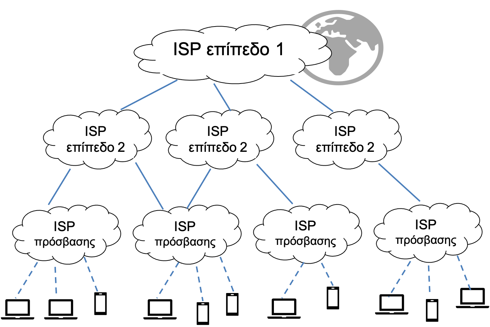

# Kallipos-book

## Οδηγίες

- Εικόνες, ενσωμάτωση με το [pandoc-xnos](https://github.com/tomduck/pandoc-xnos/)

    ```markdown
    {#fig:fig1}
    ```

    - Για να γράψουμε αναφορά σε εικόνα: "Όπως βλέπουμε στην εικόνα `@fig:fig1` ..."
    - Για να προσδιορίσουμε το πλάτος

    ```md
     {#fig:fig1 width=72%}
    ```
- Αναφορά σε ενότητα:
    - αρχικά βάζουμε label στην ενότητα:
    
    ```md
    ### Τίτλος ενότητας {#sec:my_section_label}
    ...
    ...
    Όπως βλέπουμε στην ενότητα @sec:my_section_label ....
    ```
- Ενότητητα χωρίς αρίθμηση (π.χ. για 4ου επιπεδου τίτλο):
    - Δε θα εμφανίζεται ούτε στα περιεχόμενα   
 
    ```md
    #### Τίτλος χωρίς αρίθμηση    {.unnumbered}
    ```

- Δείκτες και εκθέτες
    - Εκθέτης: `2^6^` για 2<sup>6<sup>
    - Δείκτης: `2~10~` για 2<sub>6<sub>
- Αναφορές
    - Οι αναφορές μπαίνουν στο αρχείο `bibliography.bib`. Για παράδειγμα:
    (Για να παραχθεί η παρακάτω βιβλιογαφική αναφορά χρησιοποιούμε το BibTeX Bibliography of W3C Technical Reports](https://w2.syronex.com/jmr/w3c-biblio))

        ```biblatex
        @TechReport{Lilley:18:CFM,
            author      = "Chris Lilley and Myles Maxfield and John Daggett",
            title       = "{CSS} Fonts Module Level 3",
            month       = sep,
            note        = "https://www.w3.org/TR/2018/REC-css-fonts-3-20180920/",
            year        = "2018",
            bibsource   = "https://w2.syronex.com/jmr/w3c-biblio",
            type        = "W3C Recommendation",
            institution = "W3C",
        }
        ```

    - Για να αναφερθούμε μέσα στο κείμενο γράφουμε `[@Lilley:18:CFM]`
    
- Υποσημείωση: `^[υποσημείωση]`

### Μεταγλώττιση με Pandoc

Η μεταγλώττιση γίνεται με το docker [sintoris/pandocker:twemoji](https://hub.docker.com/repository/docker/sintoris/custom-images/general)  (που βασίζεται στο dalibo/pandocker:latest).

Κατεβάζουμε το docker που περιέχει το pandoc:

```shell
docker pull sintoris/pandocker:twemoji
```

και για να μεταγλωττίσουμε εκτελούμε ένα από τα παρακάτω, και το αποτέλεσμα είναι στον φάκελο `output`.

#### Για το DOCX

Σε bash:

```shell
docker run --rm -u `id -u`:`id -g` -v `pwd`:/pandoc sintoris/pandocker:twemoji -d docx.yaml -N
```

Σε fish:

```shell
docker run --rm -u (id -u):(id -g) -v (pwd):/pandoc sintoris/pandocker:twemoji -d docx.yaml -N
```

#### Για το PDF

Σε bash:

```shell
docker run --rm -u `id -u`:`id -g` -v `pwd`:/pandoc sintoris/pandocker:twemoji -d pdf.yaml -N
```

Σε fish:

```shell
docker run --rm -u (id -u):(id -g) -v (pwd):/pandoc sintoris/pandocker:twemoji -d pdf.yaml -N
```

#### Για το HTML

Σε bash:

```shell
docker run --rm -u (id -u):(id -g) -v (pwd):/pandoc sintoris/pandocker:twemoji -d html.yaml -N -s --toc --toc-depth=3
```

Σε fish:

```shell
docker run --rm -u (id -u):(id -g) -v (pwd):/pandoc sintoris/pandocker:twemoji -d html.yaml -N -s --toc --toc-depth=3
```

### Δημιουργία/τροποίηση του docker

#### Σημειώσεις για το πως δημιουργήθηκε το docker

Αρχικά κατεβάζουμε το docker που θα αποτελέσει τη βάση:

```shell
docker pull dalibo/pandocker:latest
```

Δημιουργούμε ένα αρχείο με όνομα `Dockerfile` και περιεχόμενο αυτό του [docker/Dockerfile](https://github.com/sintoris/kallipos-web/blob/main/docker/Dockerfile)

Στη συνέχεια το κατασκευάζουμε εκτελώντας στον φάκελο που βρίσκεται το `Dockerfile`:

```shell
docker build -t sintoris/pandocker:twemoji .
```

Όταν τελειώσει το ανεβάζουμε στο repository:

```shell
docker push sintoris/pandocker:twemoji
```
